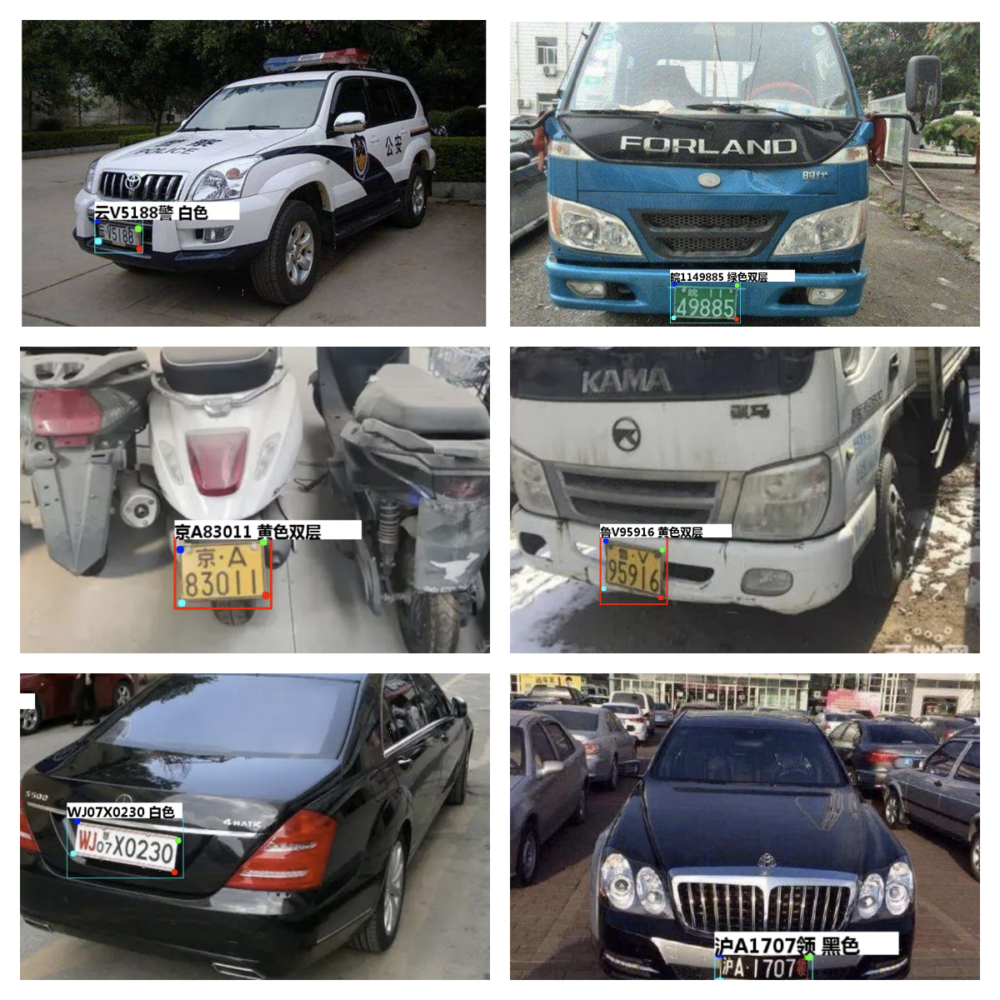

# **最全车牌识别算法，支持12种中文车牌类型**

本项目主要参考并修改自: 
1. [全种类车牌识别](https://github.com/we0091234/Chinese_license_plate_detection_recognition), 本项目修改自该项目的 YOLOv5 版.
2. [车牌检测训练](https://github.com/we0091234/Chinese_license_plate_detection_recognition/tree/main/readme)
3. [车牌识别训练](https://github.com/we0091234/crnn_plate_recognition)
4. [车辆识别训练](https://github.com/we0091234/Car_recognition)

## 目录

- [环境要求](#环境要求)
    - [最低要求](#最低要求)
    - [可运行的一种配置](#可运行的一种配置)
- [可识别的车牌类型](#可识别的车牌类型)
- [快速测试](#快速测试)
    - [图片识别测试](#图片识别测试)
    - [视频识别测试](#视频识别测试)
- [自定义处理](#自定义处理)
    - [参数解释](#参数解释)
- [训练方法](#训练方法)
    - [车辆识别](#车辆识别)
    - [车牌处理](#车牌处理)
        - [检测训练](#检测训练)
        - [识别训练](#识别训练)
- [项目分析](#项目分析)
- [参考资料](#参考资料)

## 环境要求

### 最低要求

1. `python` >= 3.6
2. `pytorch` >= 1.7

### 可运行的一种配置

1. `python` = 3.10
2. `cudatoolkit` = 11.8
3. `cudnn` = 8.9
4. `pytorch` = 2.0.1

## 可识别的车牌类型

- [X] 1.单行蓝牌
- [X] 2.单行黄牌
- [X] 3.新能源车牌
- [X] 4.白色警用车牌
- [X] 5.教练车牌
- [X] 6.武警车牌
- [X] 7.双层黄牌
- [X] 8.双层白牌
- [X] 9.使馆车牌
- [X] 10.港澳粤Z牌
- [X] 11.双层绿牌
- [X] 12.民航车牌



## 快速测试

### 图片识别测试

直接运行 `detect_plate.py`, 或在本项目根目录下运行如下命令行

```
python detect_plate.py
```

测试图片目录为 `input/imgs/`，图片识别结果保存在 `output/`.

### 视频识别测试  

```
python detect_plate.py --is_video
```

测试视频为 `input/videos/test_s.mp4`, 视频识别结果保存在 `output/test_s_result.mp4`.

## 自定义处理

### 参数解释

`detect_plate.py` 包含了项目的主函数. 

| 参数 | 定义 | 用法 |
| --- | --- | --- |
| `detect_model` | 车牌检测模型的路径, 一般保存在 `weights/` | `--detect_model <my_model_path>` |
| `plate_rec_model` | 车牌识别及颜色识别模型的路径, 一般保存在 `weights/` | `--plate_rec_model <my_model_path>` |
| `car_rec_model` | 车辆识别及颜色识别模型的路径, 一般保存在 `weights/` | `--car_rec_model <my_model_path>` |
| `is_video` | 待处理的是否为视频. 该参数为触发式, 不接受主动赋值. | `--is_video` |
| `is_color` | 是否识别颜色. 该参数为触发式, 不接受主动赋值. | `--is_color` |
| `do_draw` | 是否绘制识别框. 该参数为触发式, 不接受主动赋值. | `--do_draw` |
| `image_path` | 当未指定 `--is_video` 时, 表示待识别图片(或目录)的路径 | `--image_path <my_image_path>` |
| `video_path` | 当指定了 `--is_video` 时, 表示待识别视频的路径 | `--video_path <my_video_file>` |
| `image_size` | 需为 $32$ 的倍数. 该参数会影响识别阈值, 提高该参数会使低分目标显示出来 | |
| `output` | 输出结果保存位置 | `--output <my_output_path>` |

## 训练方法

### 车辆识别

车辆识别训练链接如下:

[车辆识别训练](https://github.com/we0091234/Car_recognition)

### 车牌处理

#### 检测训练

车牌检测训练链接如下：

[车牌检测训练](https://github.com/we0091234/Chinese_license_plate_detection_recognition/tree/main/readme)

#### 识别训练

车牌识别训练链接如下：

[车牌识别训练](https://github.com/we0091234/crnn_plate_recognition)

## 项目分析

### 定义


- **ROI 坐标**: 格式为 `(x1, y1, x2, y2)`, 记录目标区域的四条边框线坐标. 变量通常命名为 `xyxy`. 若无特别说明, ROI 区域均用 ROI 坐标表示. 

- **角点坐标列表**: 格式为 `(tlx, tly, trx, try, brx, bry, blx, bly)`, 从左上角按顺时针序依次记录四边形目标区域角点在原始图像中的坐标. 变量通常命名为 `coords`、`pts` 等.

## 参考资料

- [https://github.com/deepcam-cn/yolov5-face](https://github.com/deepcam-cn/yolov5-face)
- [https://github.com/Sierkinhane/CRNN_Chinese_Characters_Rec](https://github.com/Sierkinhane/CRNN_Chinese_Characters_Rec)